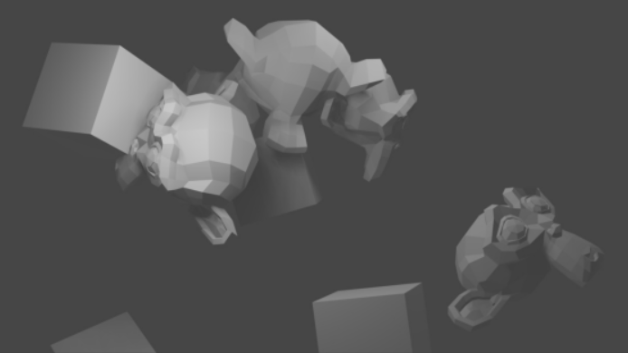

# `bpycv`: computer vision and deep learning utils for Blender

Forked from [DIYer22/bpycv](https://github.com/DIYer22/bpycv)

## Modification
### Render Instance Segmentation and Semantic Segmentation
1. **DIYer22** use `inst_id` to identify different objects, then use it to render instance segmentation images.
2. Modeled on bpycv, adding semantic segmentation rendering in `bpycv/render_utils.py`, `bpycv/material_utils.py`.

  

## Introduction & Usage
The detail is here 👉 [DIYer22/bpycv](https://github.com/DIYer22/bpycv/blob/master/README.md)
  

## Demo
1. Modify the module search path in the `render_script.py`
2. Run `blender -P render_script.py`

### RGB

### Instance Segmentation

### Semantic Segmentation

  